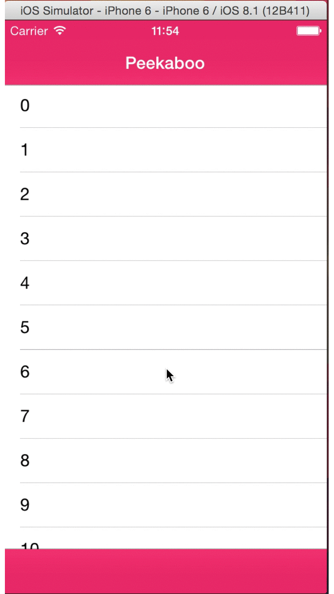

# JDFPeekaboo

[](http://cocoadocs.org/docsets/JDFPeekaboo)
[](http://cocoadocs.org/docsets/JDFPeekaboo)
[](http://cocoadocs.org/docsets/JDFPeekaboo)

JDFPeekaboo is a simple class that hides the navigation bar when you scroll down, and shows it again when you scroll back up. It can actually be any UIView that it hides, and it will also hide a view at the bottom of the screen as well, if you like.

Here's a little demo of it in use:


It's very easy to use. Simply add a property for it:

    @property (nonatomic, strong) JDFPeekabooCoordinator *scrollCoordinator;

Then, set it up (say, in `-viewDidLoad`):

``` objc
self.scrollCoordinator = [[JDFPeekabooCoordinator alloc] init];
self.scrollCoordinator.scrollView = self.scrollView;
self.scrollCoordinator.topView = self.navigationController.navigationBar;
self.scrollCoordinator.bottomView = self.navigationController.toolbar;
```

Sometimes, you may want to temporarily disable `JDFPeekaboo`, for example when you push another view controller onto your navigation controller. Some convenience methods are provided for disabling `JDFPeekaboo` (and re-enabling it). See the [documentation](http://cocoadocs.org/docsets/JDFPeekaboo/) for more info.

## Documentation

You can find the docs [here](http://cocoadocs.org/docsets/JDFPeekaboo/) (on [CocoaDocs](http://cocoadocs.org)).

You can also find a bit more info on my [blog post](http://joefryer.github.io/blog/2015/03/01/jdfpeekaboo/)

## FAQ

**Q: Why are there black spaces at the top/bottom of the screen, like this:**



A: This happens if your table view doesn't extend behind the `navigationBar`/`tabBar`. You can fix this by setting your `UIViewController`/`UITableViewController`'s `edgesForExtendedLayout` (to `UIRectEdgeTop`/`UIRectEdgeBottom`/`UIRectEdgeAll`/whatever is appropriate), or by doing the equivalent in interface builder.

## Usage

To run the example project, clone the repo, and run `pod install` from the Example directory first.

## Installation

JDFPeekaboo is available through [CocoaPods](http://cocoapods.org). To install it, simply add the following line to your Podfile:

    pod "JDFPeekaboo"

## Author

Joe Fryer, joe.d.fryer@gmail.com

Twitter - [JoeFryer88](https://twitter.com/joefryer88)

## License

JDFPeekaboo is available under the MIT license. See the LICENSE file for more info.


## Releases

#### 0.2

 - Fixed some bugs (improved landscape support).
 - Improved the showing/hiding behaviour (thanks @gbhrdt).
 - Fixed some CocoaPods stuff (thanks @GorkaMM).
 - Added some convenience methods for enabling/disabling `JDFPeekaboo`.

#### 0.1

Initial Release
